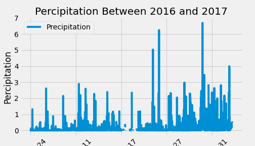
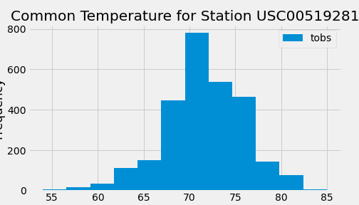
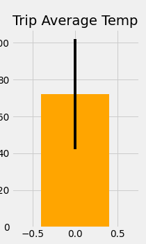
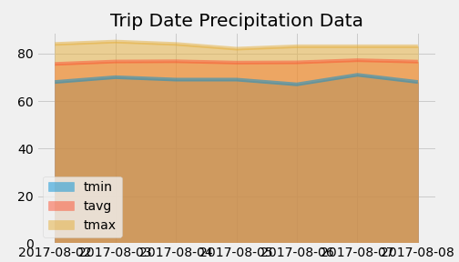

# SQL Alchemy Assignment

### Tropical Vacation

We will be using SQL Alchemy to analyze SQL-lite datebases. Using python, we will be constructing graphs and create custom API to enable users access to the information in the database.  


To do the analysis and find the results necessary to make yoru vacation a success, we would need to focus on the average temperature based on the measurement stations around the area.

## Setting up SQL Alchemy

The first thing we are going to do is to set up SQL lite. 

1. We will need to import the dependencies that we need.

```sh
  from sqlalchemy.ext.automap import automap_base
  from sqlalchemy.orm import Session
  from sqlalchem import create_engine, func, inspect
```
* First, create the engine that will link us to the database in SQL lite

```sh
  engine = create_engine("sqlite:///Resources/hawaii.sqlite")
  conn = engine.connect()
```

* The automap_base will allow us to import and map the database from SQL-lite and enable us to read the data based on classes

```sh
  Base.automap_base()
  Base.prepare(conn, reflect = True)
```
* Now we can use various auto_map functions to identify specific classes in the dataset. 

```sh
  Base.classes.key()
```

* Measurement and station will be the two classes that we are working with in the data base. From here we can isolate the data from these classes.

```sh
Measurement = Base.classes.measurement
Station = Base.classes.station
```
* We can spend some time to explore the database and see exactly what kinds of data we are working with. 

```sh
  inspector = inspect(conn)
  inspector.get_table_names()
  column_info = inspector.get_columns('measurement)
```
* column_info will have the column information in the table "measurement.
```sh
  for column in column_info:
    print(
      column['name'],
      column['tupe'],
      column['primary_key']
    )
```
* We can see all the columns which is id, station, date, prcp, and tobs. Id will be our primary key for this table and pcp/tobs are floats that we can calculate. We will do the same with the station table.

```sh
  for columns in inspector.get_columns('station'):
    print(
      columns['name'],
      columns['type'],
      columsn['primary_key']
      )
```
* The "station" table has id, station, name, latitude, logitude, elevation, and the primary key is id. Both the station and measurement tables has "station" column, so we can use that as a mechanism for joining the tables. 

* After knowing everything about the database we are working with, we can now start a connection session and query the data we need for the analysis.

```sh
  session = Session(conn)
```

### Analyzing the Precipitation Data

2. The first analysis we want to do is figure out rain in each location over the last year. 

* To begin, we can parse the date column from Measurement and query all the precipitation information we want a year from the most recent date in the dataset.

```sh
  recent_date = session.query(Measurement.date).order_by(Measurement.date.desc()).first()[0]
  recent_parsed = dt.datetime.strptime(recent_date,"%Y-%m-%d")
```

* Now we can parse the starting date, which will be set 1 year before the most recent time or the ending date.

```sh
  target_date = f"{recent_parsed.year - 1}-{recent_parsed.month:02}-{recent_parsed.day:02}"
```
* With the most recent date and the target date, we can construct our query parameters to extract the data that we need.

```sh
  result = session.query(Measurement).filter(func.strftime("%Y-%m-%d" , Measurement.date) > target_date).all()
```
* We now have all the information we need from the dataset. We can begin processing the precipitation data.

```sh
  precipation_list = []
  for row in result:
    precipation_list.append([row.date,row.prcp])
```
* Now we set it into a DataFrame for graphing

```sh
  preci_df = pd.DataFrame(precipation_list, columns  = ['Date','Precipitation'])
  preci_df.set_index('Date')
```
* Now we graph

```sh
  prec_df_sort.plot(figsize = (7,4))
  plt.title('Percipitation Between 2016 and 2017')
  plt.ylabel('Percipitation')
  plt.xticks(rotation = 45)
  plt.savefig("Images/precipitation.png")

  plt.show()
```

  


### Station Analysis

3. We will now design queries to calculate specifics temperatures of the stations

* We first calculate the most active stations and that will be based upon the number of time a station produced data off of the Measurement table. We want the min, max, and avg temperature for these stations.

```sh
  station_temp = session.query(
    Measurement.station, 
    func.count(Measurement.id),
    func.min(Measurement.tobs),
    func.max(Measurement.tobs),
    func.avg(Measurement.tobs)
    ).group_by(Measurement.station).order_by(func.count(Measurement.id).desc()).all()
```
* Now we want to graph the most common temperature for the  specific station with the highest activies.

  ```sh
    active_station_data = session.query(Measurement.date, Measurement.tobs).filter(Measurement.station == station_temp[0][0]
    ).all()
    station_df = pd.DataFrame(active_station_data, columns = ['Date','tobs'])
    station_sort = station_df.set_index('Date')
    station_sort.plot.hist(figsize = (7,4), bins = 12)
    plt.title(f' Common Temperature for Station {station_temp[0][0]}')
    plt.xlable('Temperature')
    plt.savefig('Images/active_station_info.png')

    plt.show()

  ```
 

  ### Custom API 

  4. We will now set up a custom routes for custom API off of our private local servers.

  * We first import all the dependencies that is needed. 

  ```sh
    import datetime as dt

    from sqlalchemy.ext.automap import automap_base
    from sqlalchemy.orm import Session
    from sqlalchemy import create_engine, func
    from flask import Flask, jsonify
  ```
* The we build the engine and link to our SQL-lite database

```sh
  engine = create_engine("sqlite:///Resources/hawaii.sqllite")
  conn = engine.connect()
  Base = automap_base()
  Measurement = Base.classes.measurement
  Station = Base.classes.station

  app = Flask(__name__)
```

* Create the homepage route with all the routes listed. 

```sh
  @app.route("/")
  def welcome():
    return(
    f"<h2>All Available Routes:</h2><br/>"
    f"<h2>Precipitation: /api/v1.0/precipitation</h2><br/>"
    f"<h2>List of Stations in Dataset: /api/v1.0/stations<br/>"
    f"<h2>Temperature for one year: /api/v1.0/tobs<br/>"
    f"<h2>Temperature stat from the start date(yyyy-mm-dd): /api/v1.0/yyyy-mm-dd<br/>"
    f"<h2>Temperature stat from start to end dates(yyyy-mm-dd): /api/v1.0/yyyy-mm-dd/yyyy-mm-dd"
    )
```

* Then we create a route for the precipitation/

```sh
@app.route("/api/v1.0/precipitation")
def precipitation():
  session = Session(engine)
  all_prcp = session.query(
      Measurement.date,
      Measurement.prcp
  ).all()
  session.close
  result_list = []
  for date, prcp in all_prcp:
      result = {
          'date':date,
          'precipitation':prcp, 
      }
      result_list.append(result)
  return jsonify(result_list)
```
* Then we build a route for detailes on the stations.
```sh
  @app.route("/api/v1.0/stations")
  def stations():
    session = Session(engine)
    stations = session.query(
        Station.station,
        Station.name,
        Station.longitude,
        Station.latitude,
        Station.elevation
    ).all()
    session.close
    result_list = []
    for station, name, longitude, latitude, elevation in stations:
        result = {
            'station':station,
            'name':name,
            'longitude':longitude,
            'latitude':latitude,
            'elevation':elevation
        }
        result_list.append(result)
    
    return jsonify(result_list)
```
* We can create routes for general temperatures as well.

```sh
  @app.route("/api/v1.0/tobs")
  def active_temp():
    session = Session(engine)
    active_station = session.query(
        Measurement.station
    ).group_by(Measurement.station).\
        order_by(func.count(Measurement.id).desc()).first()[0]
    station_info = session.query(Measurement.date,Measurement.prcp).filter(
        Measurement.station == active_station).all()
    session.close
    
    result_list = []    
    for date, prcp in station_info:
        result = {
            "date":date,
            "precipitation(in)":prcp
        }
        result_list.append(result)
    
    return jsonify(result_list)
```
* Lastly we can create routes for specific date and a range of dates.

```sh
  @app.route("/api/v1.0/<start>")
  def date(start):
    session = Session(engine)
    query_result = session.query(
        func.min(Measurement.tobs),
        func.max(Measurement.tobs),
        func.avg(Measurement.tobs)
        ).filter(func.strftime("%Y-%m-%d", Measurement.date) >= start).all()
    session.close
    result_list = []
    for min, max, avg in query_result:
        result = {
            'min_temp':min,
            'max_temp':max,
            'avg_temp':avg   
        }
        result_list.append(result)
    
    return jsonify(result_list)

  @app.route('/api/v1.0/<start>/<end>')
  def date_range(start,end):
    
    if dt.datetime.strptime(start,"%Y-%m-%d") < dt.datetime.strptime(end,"%Y-%m-%d"):
        session = Session(engine)
        query_results = session.query(
            func.min(Measurement.tobs),
            func.max(Measurement.tobs),
            func.avg(Measurement.tobs)
            ).filter(Measurement.date >= start).filter(Measurement.date <= end).all()    
        session.close()
        result_list = []
        for min, max, avg in query_results:
            result = {
                'min_temp':min,
                'max_temp':max,
                'avg_temp':avg   
            }
            result_list.append(result)
        return jsonify(result_list)
    else:
        return "<h1>Error calculating date range</h1>"
```
* Lastly we will set debugging paramters, in this case we want any errors to render in the browser.

```sh
  if __name__ == '__main__':
    app.run(debug=True)
```
* We can now run the server in the browser and you can find any specific information you are looking for. 

## Bonus 1

* In the bonus analysises, we are finding out changes for June and December year to year. We are also fiding out hte min, max, and average temperatures for each month and finding out the t-statistics for the table.

* We first import the dependencies that we need.

```sh
  import pandas as pd
  from datetime import datetime as dt
```
* Next we can read the csv's that were provided to us.
```sh
  dt = pd.read_csv("Resources/hawaii_measurements.csv")
```

* The we convert the date column from string to datetime.

```sh
  date_time = [dt.strptime(date, "%Y-%m-%d") for date in df['date']]
  df["date"] = datetime
  df_time = df.set_index['date']
```

* Now we can compare temperature changes from June and Decemver across various years

```sh
  june_df = df_time.loc[df_time.index.month == 6]
  dec_df = df_time.loc[df_time.index.month == 12]
```
* Now we can find the average temperature within June and December.

```sh
  june_tobs_avg = june_df['tobs'].mean()
  round(june_tobs_avg,2)
  dec_tobs_avg = dec_df['tobs'].mean()
  round(june_tobs_avg,2)
```

* Now that we have calculated the temperature summary statistics for two months, we can do the same for all the months.

```sh
  avg_temp = pd.DataFrame(['jan','feb','mar','apr','may','june','july','aug','sep','oct','nov','dec'], columns = ['month'])
  avg_temp_list = [df_time.loc[df_time.index.month == month]['tobs'].mean() for month in range(1,13)]
  avg_temp['avg_temp'] = avg_temp_list
```
* Lastly we can run the t-test for the DataFrame

```sh
  from scipy import stats

  t_test = stats.ttest_ind(avg_temp.index, avg_temp['avg_temp'])
```

#### We are left with t-statistics of -51.48 and pvalue of 1.9889e-24. Which suggests that months are sigificant in determining temperature. 

## Bonus 2

* For bonus 2, we are calculating the temperature summary statistics over specific ranges of time. 

* First we create the enging to linke th database to python.

```sh
  engine = create_engine("sqlite:///Resources/hawaii.sqlite")
  conn = engine.connect()
```

* After we will map the database so it can be raed.

```sh
  Base = automap_base()
  Base.prepare(conn, reflect = True)
```
* Now we can set the tables found in the database as variables.

```sh
  Measurement = Base.classes.measurement
  Station = Base.classes.station
```

* We can begin our session to query data for ptp graph based on ptp_error which is the max temperature minus the minimum temperature.

* We will be using the function "calc_temps" to calculate the summary statistics of min, max, and avg for temperatures in a range of time given a start_date and end_date.

```sh
start_date = "2012-01-01"
end_date = "2013-01-01"
  t_min, t_avg, t_max = calc_temps(start_date, end_date)
```

* now we can calculate the PTP error and graph the PTP graph

```sh
  ptp_error = t_max - t_min
  plt.figure(figsize = (3,5), dpi = 70)
  plt.bar(0, t_avg, yerr = ptp_error, color = 'orange')
  plt.xlim(-.75, .75)
  plt.ylabel('Temperature (F)')
  plt.title("Trip Average Temp")
  plt.savefig("Images/trip_avg_temp.png")

  plt.show()
```


* Next we want to see the average rainfall for each of the weather stations and information specific to each weather station.

```sh
  start_date = "2012-01-01"
  end_date = "2012-02-01"

  def precipation_sum(start_date, end_date):
    sel = [Station.station,Station.latitude, Station.latitude, Station.elevation, func.sum(Measurement.prcp)]
    results = session.query(*sel)\
        .filter(Station.station == Measurement.station)\
        .group_by(Measurement.station).\
            filter(Measurement.date >= start_date).\
                filter(Measurement.date <= end_date)\
                    .order_by(func.sum(Measurement.prcp).desc()).all()
    results_df = pd.DataFrame(results, columns = ['station_name','station_latitude','station_longitude','station_elevation','total_rain'])
    return results_df

  df = precipation_sum(start_date, end_date)
```
* Next we are looking for the average daily rainfall. We start by locking down a start and end date then we can use query the information and transform it to a DataFrame.

*  We will be using the daily_normals function that was provided to us and it takes a string of month - date.

```sh

# calculate the daily normals for your trip
# push each tuple of calculations into a list called `normals`

# Set the start and end date of the trip
start_date_parse = dt.datetime.strptime(start_date, "%Y-%m-%d")
end_date_parse = dt.datetime.strptime(end_date,"%Y-%m-%d")

normal = []
delta_date = start_date_parse


# Use the start and end date to create a range of dates
delta_time = end_date_parse - start_date_parse

# Use the `daily_normals` function to calculate the normals for each date string 
# and append the results to a list called `normals`.
if start_date <= end_date:
    for day in range(delta_time.days):
        delta_date += dt.timedelta(days = 1)
        # Strip off the year and save a list of strings in the format %m-%d
        tmin, tavg, tmax = daily_normals(delta_date.strftime('%m-%d'))[0]
        normal.append([delta_date.strftime("%Y-%m-%d"),tmin, round(tavg,3), tmax])
```

* Using the normals data, we can create a DataFrame.

```sh
  normal_df = pd.DataFrame(normal, columns = ['date','tmin', 'tavg', 'tmax'])
  normal_df_index = normal_df.set_index('date')
```

* Lastly we can graph it. 

```sh
  # Plot the daily normals as an area plot with `stacked=False`
  normal_df_index.plot.area(stacked = False, figsize = (7,4))
  plt.title("Trip Date Precipitation Data")
  plt.savefig("Images/trip_precipitation_data.png")
  plt.xticks(rotation = 90)

  plt.show()
```
